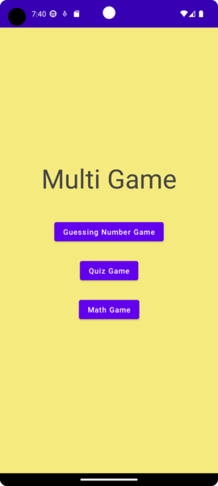
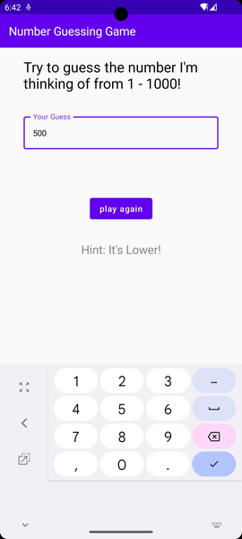
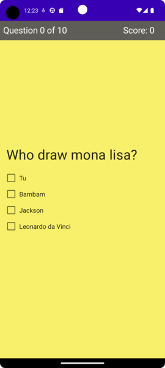
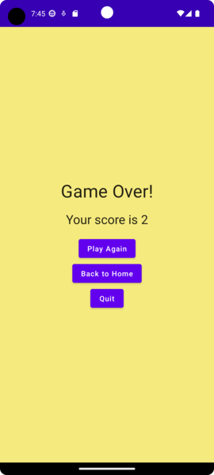
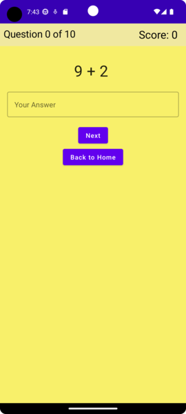
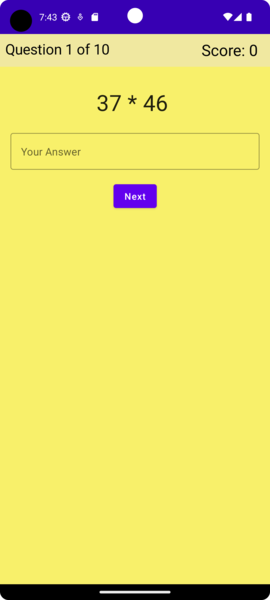
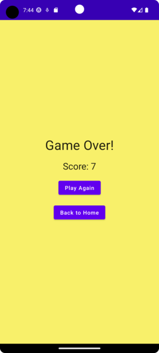

# cn333as3
# MultiGame

Using App :

 

## clipสาธิตการทำงานของเกม
[https://drive.google.com/file/d/1WVH_I-fq4ntn-8SRidNetnHlqNPKq5Al/view?usp=sharing](https://youtu.be/4a7Y22GDCcM)

Part 1 NumberGuessingGame ( 0:15 - 0:39 )
Part 2 QuizGame ( 0:46 - 1:23 )
Part 3 MathGame ( 1:27)

## Members

* Sireetorn Ontrakul 6310611048

* Chutirat Kaewchay 6310682643

## รูปแบบหน้าจอแสดงผล

  

## การทำงานของเกม
หน้าแรกจะมีตัวเลือก ให้เลือกเล่นเกม 3 เกม ได้แก่
+ NumberGuessingGame
+ QuizGame
+ MathGame

เมื่อกดเลือกเกมไหนก็จะเข้าสู่หน้าของเกมนั้นๆและสามารกดbackเพื่อกลับมายังหน้าเลือกเกมได้ 

# การทำงานของแต่ละเกม
## NumberGuessingGame

เกมทายตัวเลข ที่มีค่าตั้งแต่ 1-1000

## clipสาธิตการทำงานของเกม
https://drive.google.com/file/d/1WVH_I-fq4ntn-8SRidNetnHlqNPKq5Al/view?usp=sharing

## รูปแบบหน้าจอแสดงผล

  

## การทำงานของเกม

1. เกมจะเริ่มเมื่อผู้ใช้ทำการกรอกตัวเลขที่จะทายลงในช่อง Your Guess เสร็จแล้วทำการกด ปุ่ม Play agian 

   OUTPUT : จะแสดง Hint ใน 2 รูปแบบคือ 
    + It's Lower = ตัวเลขมีค่าต่ำกว่าตัวเลขที่ผู้ใช้ทาย
    + It's Higher = ตัวเลขมีค่าสูงกว่าตัวเลขที่ผู้ใช้ทาย

  

2. ทำการทายเลขไปเรื่อยๆ เมื่อตัวเลขที่ผู้ใช้ทายตรงกับตัวเลขของเกมที่กำหนด 

   OUTPUT : จะแสดงข้อความ Correct! และแสดงจำนวนครั้งที่ผู้ใช้ทำการทาย
  
  
  
3. เมื่อจะทำการเริ่มเล่นใหม่ ผู้ใช้สามารถกรอกตัวเลขที่จะทายและทำการเริ่มเล่นตามวิธีที่ได้กล่าวมาตามข้อ 1 และ 2 ข้างต้น

## QuizGame

## clipสาธิตการทำงานของเกมตอบคำถาม
https://youtu.be/CgxVgcBEHNE

## การทำงานของเกม

1. หน้าแรกจะเป็นหน้าเริ่มเกมหากต้องการที่จะเล่นสามารถกดที่ปุ่ม start game เพื่อเริ่มเล่นเกมได้ และสามารถกดปุ่ม Back to home กลับได้เช่นเดียวกัน
  
  

2. โปรแกรมจะทำการสุ่มคําถามมาหนึ่งคําถาม และแสดงตัวเลือก 4 ตัวเลือกโดยจะมีการจัดเรียงแบบสุ่มเช่นกัน โดยจะมีแทบด้านบนแสดงว่าตอบคำถามไปกี่คำถามแล้วจากกี่ทั้งหมดคำถามและแสดงscore ของผู้เล่นว่าตอบคำถามได้ถูกต้องไปแล้วกี่ข้อ โดยคำถาม 1 ข้อหากตอบถูกจะได้รับ 1 คะแนน

  
  
3. เมื่อเล่นจนครบทุกคำถามก็จะเข้าสู่หน้า game over หน้านี้จะสรุปคะแนนให้ว่าผู้เล่นได้คะแนนทั้งหมดเท่าไร และจะมีทางเลือกให้ผู้เล่นเลือกว่าจะเล่นอีกครั้งหรือออกจากเกมโดยหากกดปุ่ม quit ก็จะออกจากเกมไป แต่หากกดปุ่ม play again ก็จะกลับไปสู่หน้าแรกของเกมจากนั้นก็สามารถกดปุ่ม start game เพื่อเล่นอีกครั้งได้ 

  

## MathGame
## เป็นเกมคำนวณตัวเลขทางคณิตศาสตร์

## clipสาธิตการทำงานของเกม
https://drive.google.com/file/d/1WVH_I-fq4ntn-8SRidNetnHlqNPKq5Al/view?usp=sharing

1. เกมจะเริ่มเมื่อผู้ใช้ทำการกรอกตัวเลขที่จะคำนวณได้ ทำการกด ปุ่ม Next เพื่อไปข้อถัดไป

   OUTPUT : แสดงจำนวนข้อทั้งหมดและจำนวนข้อปัจจุบันที่ทำไปแล้ว, จะแสดง Score
   + ถ้าคำตอบถูก จะได้ 1 คะแนน
   + ถ้าคำตอบผิด จะไม่นับคะแนน และไปยังข้อถัดไป
   
  
  
  ส่วนนี้จะเป็นหน้าแรกของเกมจะมีปุ่ม Back to home เพื่อกลับไปสู่หน้า Home ได้
  
  

2. ตอบคำถามให้ครบ 10 ข้อ จะแสดงคะแนนรวมของผู้เล่น

  
  
3. สามารเริ่มเล่นใหม่โดยการกดปุ่ม play again

